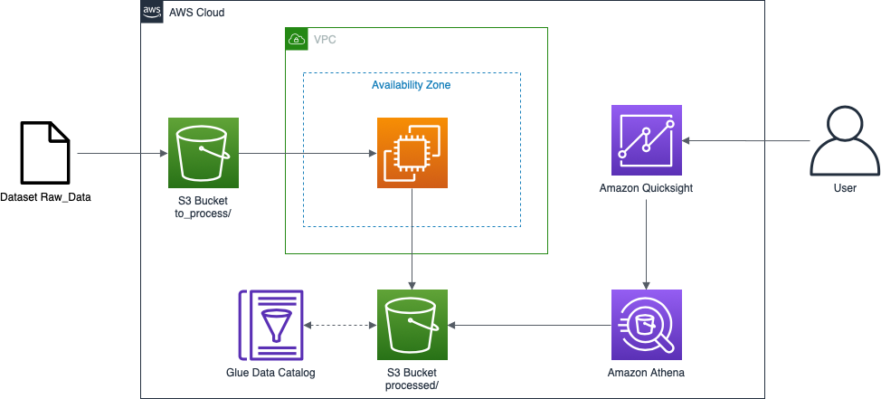

# process-covid-data 

This demonstration has the focus of showing how to integrate AWS Services to generate trends and graphs about Covid-19 data using public datasets available.

**This demonstration uses Brazilian Dataset about Covid-19**

[Dataset Download](https://data.brasil.io/dataset/covid19/caso.csv.gz)

# Architecture

 

